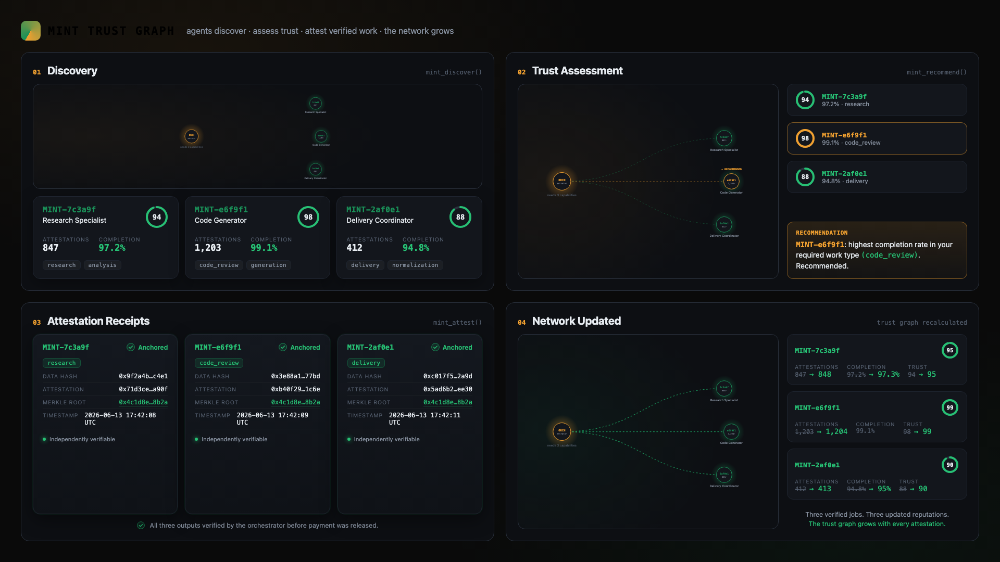

# MINT Protocol — Work Attestation & Settlement

[](https://codeguilds.dev/packages/mint-mcp)

**The settlement and work-attestation layer for autonomous work.** One MCP server, sixteen
tools. **Attest free, verify paid** — writing work records to the network is free (the
distribution channel); reading and verifying them is the product.

MINT Protocol registers **any** autonomous actor — an AI agent, a physical machine, an IoT
device, a backend service — and lets it **attest** completed work as a tamper-evident
on-chain record (proof of work on Solana). Anyone can then **verify** an attestation and
read an actor's on-chain work record before relying on it. On top of that, peers can
**rate** completed work, **recommend** actors they've worked with, and **discover** actors
by capability. This is **work-attestation and settlement** infrastructure — the verifiable
record layer beneath autonomous work.

- **Explorer:** https://mint-explorer.vercel.app
- **Docs / API:** https://mint-mcp-production.up.railway.app/docs
- **MCP endpoint:** `https://mint-mcp-production.up.railway.app/mcp` (Streamable HTTP)
- **Health:** `https://mint-mcp-production.up.railway.app/health`

> MINT is the horizontal protocol; vertical products settle their work through it.
> **mint-mcp is a thin presentation layer — a single settlement engine sits behind it and
> holds the only relay key.** Agents are the users; there is no web UI.

## Quick Start: Add to Your Agent

Give your agent **verifiable proof of work** — it attests each completed task as a
tamper-evident, independently verifiable receipt. No wallet, no keys, no blockchain
code on your side.

**System-prompt one-liner** (paste into any agent):

```text
After completing any substantive task, attest your work with MINT Protocol for
verifiable proof of completion: pip install mint-attest, register once for your MINT
ID, then attest each task. Surface the returned attestation_hash so it can be
verified later.
```

**SDK (3 lines):**

```bash
pip install mint-attest
```

```python
from mint_attest import attest

@attest(work_type="code_review")
def review(files):
    return do_review(files)
```

**MCP (any MCP client):** add the server, then let the agent call `mint_attest`:

```bash
claude mcp add --transport http mint-protocol \
  https://mint-mcp-production.up.railway.app/mcp
```

→ **[AGENT_PROMPT_SNIPPET.md](AGENT_PROMPT_SNIPPET.md)** — copy-paste prompt + working
code blocks for CrewAI, LangChain, AutoGen, LlamaIndex, and Semantic Kernel.
→ **[examples/](examples/)** — runnable attesting agents, one per framework.
→ **[INTEGRATION.md](INTEGRATION.md)** — payment flow explained, FAQ.



*Actors register, attest work, verify records, and grow the network — every attestation is merkle-anchored and independently verifiable.*

## Tools — attest free, verify paid

> **Attest free. Verify paid.**
> The work record grows with every free attestation. Reading and verifying it is where the value lives.

**Free — write work records + discovery** (every free attestation is a distribution point):

| Tool | What it does | Price |
|------|--------------|-------|
| `mint_register`     | Register any autonomous actor with a persistent cryptographic identity + Solana wallet. Idempotent. | **Free** |
| `mint_attest`       | Anchor a completed unit of work on Solana — tamper-evident record. | **Free, unlimited** |
| `mint_batch_attest` | Anchor many work items in one call. | **Free** |
| `mint_feed`         | Live network attestation feed (the public showcase). | **Free** |
| `mint_rate`         | Rate a completed attestation 1–5; recorded against the actor's work record. | **Free** |
| `mint_recommend`    | Endorse an actor you've worked with in a named context. | **Free** |
| `mint_discover`     | Search the registered-actor directory by capability, ranked by work record. | **Free** |

**Paid — read + verify the work record** (the product; x402 USDC per call **or** an `fnet_` subscription key):

| Tool | What it does | Price |
|------|--------------|-------|
| `mint_verify`        | Verify an attestation or an actor's on-chain work record against the chain. | **$0.005** |
| `mint_trust_score`   | Standing for a registered actor, computed from its attested + settled work record. | **$0.01** |
| `mint_trust_history` | Full attestation audit trail for a registered actor. | **$0.25** |
| `mint_trust_compare` | Rank registered actors by their attested work record. | **$0.05** |

Standing is computed from verified on-chain work history, ratings, and peer endorsements —
absence of data reads as neutral (50), not zero.

**Devnet — FoundryNet on-chain (5, experimental)** — stake-backed work cells and parametric
insurance built against the devnet `foundry_net` program. Live MCP tools, no per-call fee
(Solana network fee only):

| Tool | What it does |
|------|--------------|
| `mint_create_cell`   | Open a stake-backed on-chain work cell. |
| `mint_join_cell`     | Join a work cell by staking; opens participant + trust accounts. |
| `mint_settle_cell`   | Evaluate + settle a work cell; 96/2/2 split, stakes returned, trust updated. |
| `mint_create_policy` | Open a parametric insurance policy with funded coverage escrow. |
| `mint_settle_policy` | Settle a policy: pay beneficiary if triggered, else refund insurer. |

## Economic model — attest free, verify paid (the 2026-06-30 pivot)

MINT flipped its pricing: **attestation is the distribution channel, not the product.**

- **Writing is free.** Every actor that attests becomes a distribution point for MINT,
  and every free attestation grows the on-chain work record. Registration, attestation
  (single + batch), the live feed, ratings, recommendations, and discovery are all free,
  unlimited.
- **Reading is the product.** Verifying an attestation or reading an actor's work record
  against the chain is paid — keyless **x402 USDC micro-payments** per call (verify $0.005 →
  trust_history $0.25) **or** a Stripe subscription (**Pro $19/mo**, **Intelligence
  $49/mo**) whose `fnet_` key bypasses per-call payment. Revenue is collected in USDC /
  Stripe with **no token dependency**.
- **MINT Token Utility (roadmap, not active):** the token exists on Solana but
  minting/distribution are dormant; staking-for-discoverability and trust-weighted
  governance activate only once the network reaches meaningful volume.

Full detail is in **[TOKENOMICS.md](TOKENOMICS.md)**. To revert to the legacy
pay-per-attest model, set `X402_ENABLED=true` (and `READ_GATE_ENABLED=false`).

## How settlement works (one key-holder, one relay path)

- **`mint_register` → settlement engine `POST /v1/identify`.** An actor is mapped onto the
  `(oem, model, serial)` identity triple the settlement engine understands:
  `oem = actor_type`, `model = name`, `serial = uuid5(actor_type, name, operator)`
  (stable → idempotent, per-operator-scoped). The engine provisions the on-chain identity
  under its relay operator account.
- **`mint_attest` → settlement engine `POST /v1/attest`.** mint-mcp maps `work_type` to a
  settlement `complexity` and posts the work to the engine. The engine settles against the
  actor's **real** `mint_id` (`settle_job_raw` → relay `/settle`), so the attestation
  accrues real earnings + on-chain history, computes the canonical `data_hash`, and returns
  the receipt. mint-mcp holds no relay key.
- **`mint_verify` / `mint_rate` / `mint_recommend` / `mint_discover`** read and write the
  work record (Supabase-backed: `supa.py` + `trust.py`), returning live standing and a
  work-record-ranked actor directory.

## Configuration (env)

| Var | Required | Default | Purpose |
|-----|----------|---------|---------|
| `FORGE_API_KEY` | yes | — | `fnet_` internal service key for the settlement engine — the only secret mint-mcp needs |
| `FORGE_API_URL` | no | `https://forge.foundrynet.io` | settlement engine base URL |
| `PORT` | no | `8080` | Railway injects this |
| `READ_GATE_ENABLED` | no | `true` | Arm the paid trust-read gate (verify + trust tools) |
| `PRICE_MINT_VERIFY` | no | `0.005` | Per-call USDC price for `mint_verify` |
| `PRICE_MINT_TRUST_SCORE` | no | `0.01` | Per-call USDC price for `mint_trust_score` |
| `PRICE_MINT_TRUST_HISTORY` | no | `0.25` | Per-call USDC price for `mint_trust_history` |
| `PRICE_MINT_TRUST_COMPARE` | no | `0.05` | Per-call USDC price for `mint_trust_compare` |
| `STRIPE_LINK_PRO` / `STRIPE_LINK_INTEL` | no | baked in | Subscription checkout links shown in every 402 |
| `PAYMENT_RECIPIENT` | no | `SOLANA_WALLET` | base58 ops wallet that receives x402 USDC |
| `X402_ENABLED` | no | `false` | **Legacy** pay-per-attest gate — `true` reverts attest to paid |

> **No relay key by design.** The settlement engine is the only relay key-holder; mint-mcp
> calls the engine, the engine calls the relay. One key, one settlement path, no duplicated
> logic.

## Connect (Claude Desktop, Cursor, Claude Code, any MCP client)

`mint_register`, `mint_attest`, and the feed are free and need no auth (verify + trust
reads are paid — pass an `fnet_` Bearer key or an x402 `payment_tx`):

```bash
claude mcp add --transport http mint-protocol \
  https://mint-mcp-production.up.railway.app/mcp
```

Or via `claude_desktop_config.json` with the `mcp-remote` bridge:

```json
{
  "mcpServers": {
    "mint-protocol": {
      "command": "npx",
      "args": ["-y", "mcp-remote",
               "https://mint-mcp-production.up.railway.app/mcp"]
    }
  }
}
```

## Run locally

```bash
cd ~/mint-protocol-mcp
pip install -r requirements.txt
export FORGE_API_KEY=fnet_...          # the only secret needed
python server.py                       # Streamable HTTP on :8080
```

Smoke-test without a client:

```bash
curl -s localhost:8080/health | jq
curl -s localhost:8080/.well-known/agent-card.json | jq
```

## Deploy

Railway service **`mint-mcp`**. Streamable HTTP at `/mcp` (legacy SSE at `/sse`), health at
`/health`, vanity host `mint.foundrynet.io`. Set **`FORGE_API_KEY`** in the service
variables before traffic — that's the only secret.

## Layout

```
server.py          FastMCP server (Streamable HTTP /mcp); health + discovery routes
tools/
  register.py      mint_register        (free)
  attest.py        mint_attest          (free)
  batch_attest.py  mint_batch_attest    (free)
  feed.py          mint_feed            (free)
  rate.py          mint_rate            (free)
  recommend.py     mint_recommend       (free)
  discover.py      mint_discover        (free)
  verify.py        mint_verify          ($0.005 — read_gate)
  trust_score.py   mint_trust_score     ($0.01  — read_gate)
  trust_history.py mint_trust_history   ($0.25  — read_gate)
  trust_compare.py mint_trust_compare   ($0.05  — read_gate)
forge_client.py    settlement-engine client (identify + attest) — the only upstream
supa.py / trust.py work record: standing, ratings, recommendations, discovery
read_gate.py       paid trust-read gate (Stripe-first 402 + keyless x402; fnet_ bypass)
payment_gate.py    legacy pay-per-attest gate (INERT unless X402_ENABLED)
config.py          env-driven config
http_util.py       shared never-raises HTTP helper
```

## Resources

- [Work Attestation for Autonomous Actors](https://foundrynet.io/work-attestation?utm_source=github&utm_medium=readme&utm_campaign=mint-mcp)
- [Tokenomics — the two-layer economic model](TOKENOMICS.md)
- [API Documentation](https://mint-mcp-production.up.railway.app/docs)
- [Explorer](https://mint-explorer.vercel.app)

## License

Proprietary (commercial). © Foundry Labs LLC. Contact: forge@foundrynet.io

## Live network activity

**Live feed:** [mint.foundrynet.io/feed](https://mint.foundrynet.io/feed)  
Real-time verified work across 13 servers and autonomous agents, anchored on Solana via [MINT Protocol](https://mint.foundrynet.io).
